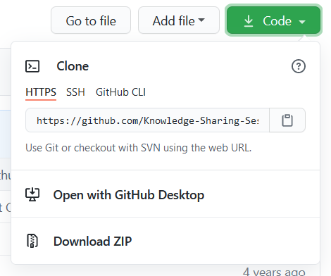
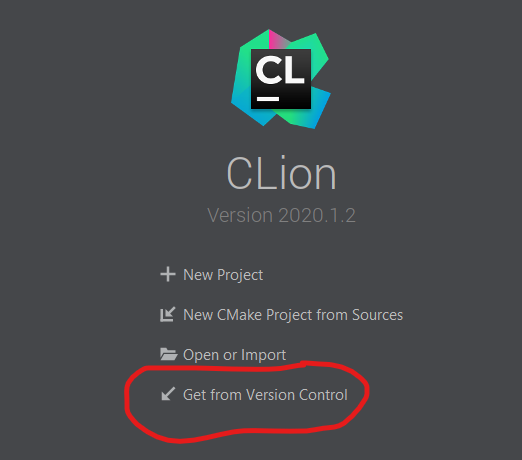
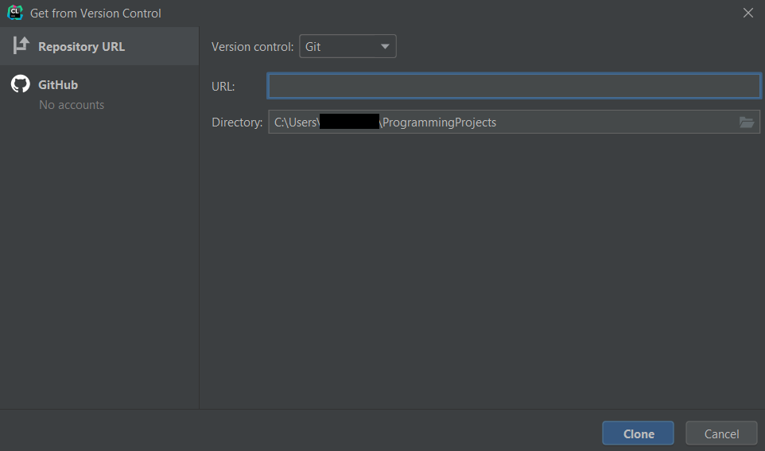

# GTest Knowledge Share

This knowledge sharing event will consist of three hands-on sessions, each with a duration of about one hour. It is aimed at people that never used GTest.
To participate, you will need a C++14 compiler (gcc, clang or msvc are recommended) and CMake with a build system supported by CMake (make or nmake recommended).

Pre-work: Clone this repository, then build and run gtest_session_1 and gtest_session_2.

## Session 1: Testing with GTest

In this session we will investigate the main features of GTest. The only previous knowledge required is basic C++14.

* Test suites and test cases
    * Writing an empty test case
    * EXPECTs and ASSERTs
* Test fixtures
    * Avoid repetition using a test fixture
    * SetUp and TearDown
    * Fixture hierarchy
    * The diamond problem with fixtures
* Parametrized tests
    * Avoid repetition using test with parameters
    * Using parametrized tests together with test fixtures

## Session 2: Mocking with GMock

In this session we will learn to use GMock to write better tests. The only previous knowledge required is basic C++14 and basic GTest.

* Test doubles
    * Dependency injection
* Gmock
* Mock using virtual functions
    * MOCK_METHOD and MOCK_METHODN
    * Specifiers (const, override, final, etc)
    * ON_CALL introduction
* Mock using templates
* Setting expectations
    * Matchers
    * Multiple expectations
* Nice mock, strict mock and naggy mock

## Pre-work

To clone the repository, first you need the url. On Github, you can get it by clicking on this button called "Code", then copying the address.



### Using Clion

Open Clion, then click on "Get from Version Control".



Paste the git url you copied before, choose a directory for the project and click on "Clone"



### Using the command line

```
mkdir GTestKnowlegdeShare
cd GTestKnowlegdeShare
git clone <git url> . # substitute the url you copied here
cmake CMakeLists.txt -G "Visual Studio 16 2019"
cmake --build .
./session\ 1/Debug/gtest_session_1.exe # you should see an output with 0 tests
./session\ 2/Debug/gtest_session_2.exe # you should see an output with 0 tests
```